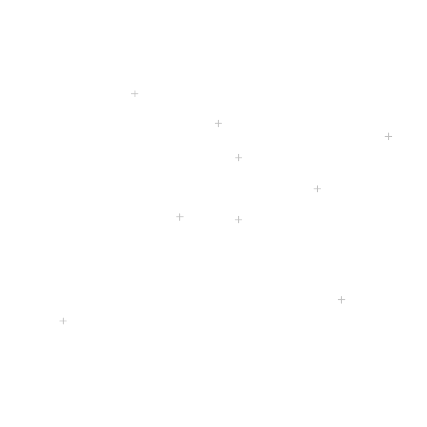

 #  <center> R语言空间插值的几种方法及案例应用<center> 

## 1.加载相关包


```R
library(raster)
library(sp)
library(rgdal)
library(gstat)
library(raster)
library(maptools)
library(dismo)
library(fields)
```

    Warning message:
    "程辑包'raster'是用R版本4.2.1 来建造的"
    载入需要的程辑包：sp
    
    Warning message:
    "程辑包'rgdal'是用R版本4.1.3 来建造的"
    Please note that rgdal will be retired by the end of 2023,
    plan transition to sf/stars/terra functions using GDAL and PROJ
    at your earliest convenience.
    
    rgdal: version: 1.5-30, (SVN revision 1171)
    Geospatial Data Abstraction Library extensions to R successfully loaded
    Loaded GDAL runtime: GDAL 3.4.1, released 2021/12/27
    Path to GDAL shared files: D:/Rabout/R-4.1.2/library/rgdal/gdal
    GDAL binary built with GEOS: TRUE 
    Loaded PROJ runtime: Rel. 7.2.1, January 1st, 2021, [PJ_VERSION: 721]
    Path to PROJ shared files: D:/Rabout/R-4.1.2/library/rgdal/proj
    PROJ CDN enabled: FALSE
    Linking to sp version:1.4-6
    To mute warnings of possible GDAL/OSR exportToProj4() degradation,
    use options("rgdal_show_exportToProj4_warnings"="none") before loading sp or rgdal.
    
    Warning message:
    "程辑包'gstat'是用R版本4.2.1 来建造的"
    Warning message:
    "程辑包'maptools'是用R版本4.1.3 来建造的"
    Checking rgeos availability: TRUE
    Please note that 'maptools' will be retired by the end of 2023,
    plan transition at your earliest convenience;
    some functionality will be moved to 'sp'.
    
    Warning message:
    "程辑包'dismo'是用R版本4.2.1 来建造的"
    Warning message:
    "程辑包'fields'是用R版本4.2.1 来建造的"
    载入需要的程辑包：spam
    
    Warning message:
    "程辑包'spam'是用R版本4.1.3 来建造的"
    Spam version 2.8-0 (2022-01-05) is loaded.
    Type 'help( Spam)' or 'demo( spam)' for a short introduction 
    and overview of this package.
    Help for individual functions is also obtained by adding the
    suffix '.spam' to the function name, e.g. 'help( chol.spam)'.
    
    
    载入程辑包：'spam'
    
    
    The following objects are masked from 'package:base':
    
        backsolve, forwardsolve
    
    
    载入需要的程辑包：viridis
    
    Warning message:
    "程辑包'viridis'是用R版本4.1.3 来建造的"
    载入需要的程辑包：viridisLite
    
    
    Try help(fields) to get started.
    
    

## 2.读取数据
* 边界shp文件
* 数据shp文件
>备注：保证投影坐标系统一(R中转换不方便，建议在ArcGIS中完成)


```R
bound<-readOGR(file.choose())
plot(bound,col="grey")
```

    OGR data source with driver: ESRI Shapefile 
    Source: "D:\Desktop\武汉主城区shp\Export_Output.shp", layer: "Export_Output"
    with 103 features
    It has 5 fields
    Integer64 fields read as strings:  OBJECTID 
    


    

    


```R
dsp <- readOGR(file.choose())
plot(dsp,col="grey")
```

    OGR data source with driver: ESRI Shapefile 
    Source: "D:\Desktop\out.shp", layer: "out"
    with 9 features
    It has 9 fields
    


    

    


## 3.shp格式转栅格


```R
#layout(matrix(1:4, ncol=2, byrow=TRUE))
#res<-c(20,100,500,1000)
#上述代码测试栅格合适分辨率时开启
res<-c(1000)
for(r in res){
blank_raster<-raster(nrow=r,ncol=r,extent(bound))
values(blank_raster)<-1
bound_raster<-rasterize(bound,blank_raster)
bound_raster[!(is.na(bound_raster))] <- 1
plot(bound_raster,main=paste("Res: ",r,"*",r))
plot(bound,add=T)
}
```


    

    


## 4.邻域多边形插值
>数据量太少，有警告


```R
v <- voronoi(dsp)
v1<-intersect(v,bound)
#spplot(v1, "C", col.regions=rev(get_col_regions()))
vr <- rasterize(v1,bound_raster,"C")
spplot(vr)
```

    Warning message in proj4string(x):
    "CRS object has comment, which is lost in output; in tests, see
    https://cran.r-project.org/web/packages/sp/vignettes/CRS_warnings.html"
    


    

    


## 5.最近邻点插值


```R
gs<-gstat(formula=C~1,location=dsp,nmax=5,set=list(idp=0))
nn<-interpolate(bound_raster,gs)
nnmask<-mask(nn,bound_raster)##掩膜提取
spplot(nnmask)
```

    [inverse distance weighted interpolation]
    


    

    


## 6.反距离加权插值


```R
gs <- gstat(formula=C~1, locations=dsp)
idw <- interpolate(bound_raster, gs)
idwmask<-mask(idw,bound_raster)
spplot(idwmask)
```

    [inverse distance weighted interpolation]
    


    

    


## 7.普通克里金插值


```R
#求变异函数,绘制半变异图
v<- variogram(log(C) ~ 1, data =dsp)
plot(v,plot.number=T)
```


    

    


```R
#选择合适的拟合函数
show.vgms()
```


    

    


```R
#拟合模型
v.fit<-fit.variogram(v,model=vgm(1,"Lin",0))
plot(v,v.fit)
```


    

    


```R
#点位数值预测
Grid<-as(bound_raster,"SpatialGridDataFrame")#首先现将边界栅格转成空间网格
kri<-krige(formula=C~1,model=v.fit,locations=dsp,newdata=Grid,nmax=12, nmin=10)#location为已知点的坐标；newdata为需要插值的点的位置；nmax和nmin分别代表最多和最少搜索点的个数
spplot(kri["var1.pred"])
```

    [using ordinary kriging]
    


    

    


### ArcGIS结果


## 8.薄盘样条函数


```R
m <- Tps(coordinates(dsp), dsp$C)
tps <- interpolate(bound_raster, m)
tps <- mask(tps, bound_raster)
spplot(tps)
```

    Warning: 
    Grid searches over lambda (nugget and sill variances) with  minima at the endpoints: 
      (GCV) Generalized Cross-Validation 
       minimum at  right endpoint  lambda  =  0.0002461982 (eff. df= 8.550006 )
    


    

    


>[参考网址;https://zhuanlan.zhihu.com/p/39525002](https://zhuanlan.zhihu.com/p/39525002)
